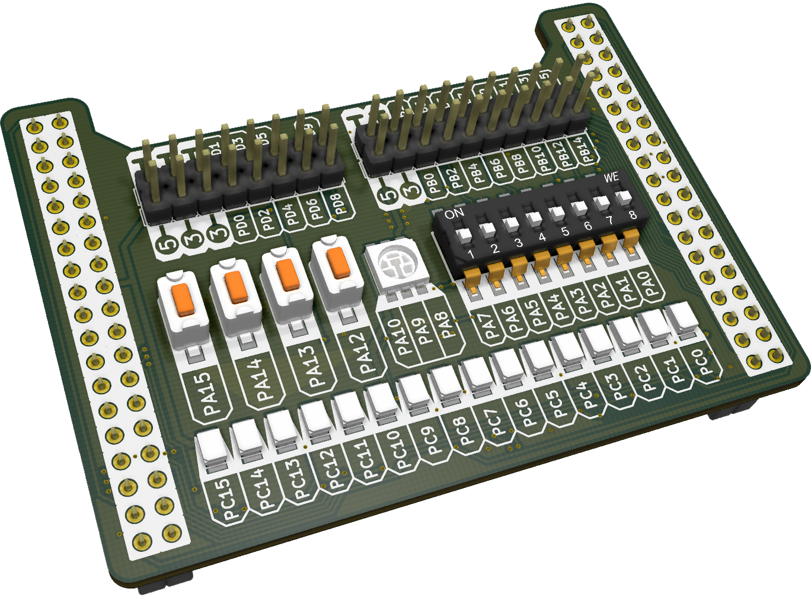
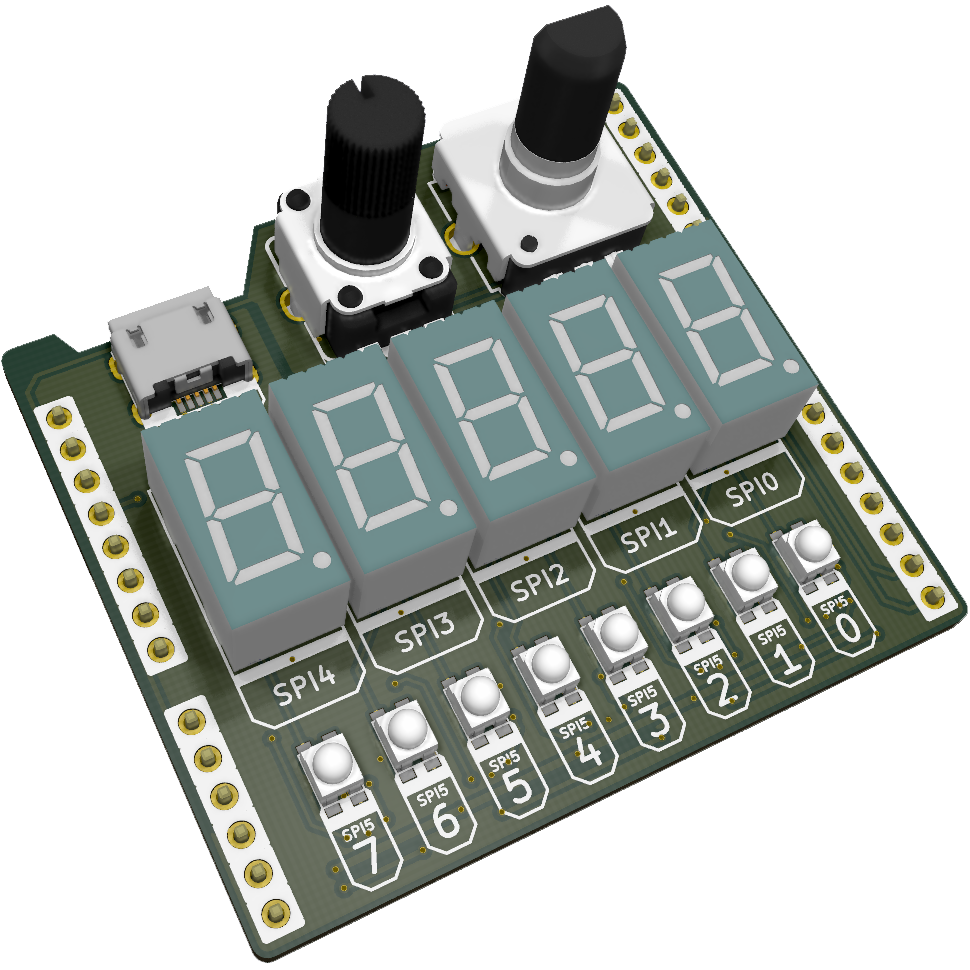

## ⚓ Content

- [IDE, Dioda, Przycisk](#ide-dioda-przycisk-)
- [Liczniki](#liczniki-)
- [Biblioteka GPIO](#biblioteka-gpio-)
- [Biblioteka DELAY](#biblioteka-delay-)
- [Sygnał PWM](#sygnał-pwm-)
- [Przetwornik analogowo cyfrowy ADC](#przetwornik-analogowo-cyfrowy-adc-)
- [Komunikacja UART](#komunikacja-uart-)
- [Układ nadzorujący Watchdog](#uklad-nadzorujący-watchdog-)

Podczas tego kursu będziemy pracowali z procesorem **STM32G071RB** na deb-board'zie **nucleo**. Pracując takimy płytkami dobrze jest mieć pod ręką rysunek z oznaczonymi wyprowadzeniamu. Nie ma za  co 😜


# IDE, Dioda, Przycisk [➥](#-content)

Moim zdaniem w nauce programowania, _potem w sumie też_, ważne jest żeby osiągać jakieś efekty szybko. Praca z systemami wbudowanymi posiada niekończące się zagadanienia poboczne, jak konfiguracja środowiska, hardware itd. Zatem pominiemy to wszystko, ściągniemy środowisko [**STM32CubeIDE**](https://www.st.com/en/development-tools/stm32cubeide.html), dostarczane **ST**, klonujemy repozutorium **nucleo** i dodajemy [template](./template) jako projekt:

Project Exploler `⟶` Right click `⟶` **Import** `⟶` Existing Project into Workspace

```cpp
int main(void)
{
  RCC->IOPENR |= (1 << 0);

  GPIOA->MODER &= ~(3 << (2 * 5));
  GPIOA->MODER |= (1 << (2 * 5));

  while(1)
  {
    GPIOA->ODR |= (1 << 5);
    delay_ms(200);
    GPIOA->ODR &= ~(1 << 5);
    delay_ms(200);
  }
}
```

W nowszych procesorach, które dodatkowo są zoptymalizowane pod kontem aplikacji energooszczędnych wszystkie peryferia trzeba włączyć. Tak samo jest tutaj. Na początku programu wpisujemy 1 do rejestru [`RCC->IOPENR`](http://www.sqrt.pl/datasheet/STM32G0x1.pdf#page=147) na pozycji 0. Tą operacją doprowadzamy sygnał zegarowy do peryferium **GPIOA**.

W kolejnych liniach ustawiamy wyprowadzenie **PA5** na wyjście przez ustawienie wartości `01` do odpowiedniego pola rejestru [`GPIOA->MODER`](http://www.sqrt.pl/datasheet/STM32G0x1.pdf#page=205).

W pętli głównej na przemian ustawiamy i kasujemy bit z rejestru [`GPIOA->ODR`](http://www.sqrt.pl/datasheet/STM32G0x1.pdf#page=207). Te operacje na przemian ustawiają na wyjściu stan wysoki i niski, co skutkuje zapalaniem i gaszeniem diody. Oczywiście efekt ten jest zauważalny dzięki funkcji delay_ms.

```cpp
#define delay_ms(ms) for(int __i = 1592 * ms; __i; __i--)
```

W procesorach STM32 nie mamy wbudowanej funkcji `delay_ms` tak jak to działało w mikrokontrolerach **AVR**. Po prostu nie ma takeij potrzeby, ponieważ w procesorze Atmega328P mieliśmy 3 timery z czego w **Arduino** jeden był wykorzystywany do _nie wiem czego_. Procesory **STM32** z rodziny **G0** mamy do dyspozycji 12 timerów (nie licząc watchdoga) i jeden z nich możemy wykorzystać w celu oprogramowania funkcji `delay_ms`. Takie rozwiązanie będzie znacznie bardziej dokładne i precyzyjne. Nie mniej takie rozwiązanie będzie wystarczające w wielu przypadkach.

Na tym etapie warto usunąć linijki zawierające funkcje `delay_ms` oraz odpalić kod w debugerze 🐞.

Wracając do samego kodu. W przypadku niektórych rejestrów dobrą praktyką może okazać się zastąpienie przesunięć bitowych definicjami, które są zawartę w plikach nagówkowych dostarczomchy przez ST.

```cpp
int main(void)
{
  RCC->IOPENR |= RCC_IOPENR_GPIOAEN;

  GPIOA->MODER &= ~GPIO_MODER_MODE5;
  GPIOA->MODER |= GPIO_MODER_MODE5_0;

  while(1)
  {
    GPIOA->ODR |= GPIO_ODR_OD5;
    delay_ms(200);
    GPIOA->ODR &= ~GPIO_ODR_OD5;
    delay_ms(200);
  }
}
```

Oczywiście operacje migania można zrealizować prościej, za pomocą operacji XOR

```cpp
while(1)
{
  GPIOA->ODR ^= GPIO_ODR_OD5;
  delay_ms(200);
}
```

Najlepszym jednak sposobem jest na zmianę stanu wyjścia jest skorzystanie z rejestru [`GPIOA->BSRR`](http://www.sqrt.pl/datasheet/STM32G0x1.pdf#page=208). Pozwala on _atomowo_ wstawić do rejestru `GPIOA->ODR` 1 lub 0. Instrukcja `GPIOA->ODR |= GPIO_ODR_OD5` w praktyce wykonuje 3 operacje.

- Pobranie wartości z rejestru `GPIOA->ODR`
- Wykonanie sumy bitowej z wartością `GPIO_ODR_OD5`
- Wpisanie do rejestru `GPIOA->ODR` wyniku operacji

W bardziej skomplikowanych aplikacjach na skutek przerwania jakaś instrukcja mogłaby się wcisnąć w środek naszej operacji, co może wprowadzać komplikacje. Korzystając z rejestru `GPIOA->BSRR` procesor wykonuje jedną operacją, co czynie tą operację niepodzielną - _atomową_.

```cpp
while(1)
{
  GPIOA->BSRR |= GPIO_BSRR_BS5;
  delay_ms(200);
  GPIOA->BSRR |= GPIO_BSRR_BR5;
  delay_ms(200);
}
```

Migająca dioda już za nami - teraz pora na przycisk. Zanim jednak zabierzemy się za jego konfigurację warto przejrzeć się wszystkim [konfiguracją **GPIO**](http://www.sqrt.pl/datasheet/STM32G0x1.pdf#page=197)

Przycisk na płytce **nucleo** jest od razu podciągnięty do zasilania _(pull-up)_, więc wystarczy ustawić na jako wejście i odczytywać jego stan. Niech nasz program świeci diodą w przypadku wciśnięcia przycisku, a w przeciwnym razie niech dioda pozostanie zgaszona.

```cpp
RCC->IOPENR |= RCC_IOPENR_GPIOCEN;
GPIOC->MODER &= ~GPIO_MODER_MODE13;

while(1)
{
  if(!(GPIOC->IDR & (1 << 13))) GPIOA->BSRR |= GPIO_BSRR_BS5;
  else GPIOA->BSRR |= GPIO_BSRR_BR5;
}
```

## Shields [➥](#-content)

Powyższe kody będą działać na _"gołej"_ płytce nucleo. Dalej będą wykorzystywane **shield**'y, czyli nakładki, które można połączyć na kanapkę z naszą płytką bazową

| Nakładka Input-Output     | Nakładka Measurement       |
| ------------------------- | -------------------------- |
|  |  |

Oczywiście bez problemu można pracować bez tych płytek, ale jeśli preferujemy rozpocząć zabawę od _copy-paste_ to polecam. Warto wówczas na płytce nucleo dokonać dwóch drobnych modyfikacji...

## Świecąca linijka LED [➥](#-content)

Wyprowadzenia `PC0`-`PC15` są podłączone do kolejnych diod.
W programie jedynka z rejestru `GPIOC->ODR` jest przesuwana na lewo (`<<`).
Gdy dochodzi do diody `PC15` kierunek zmienia się na prawo (`>>`).
Całość sprawia wrażenie, że święcący punk przesuwa się na lewo i prawo.

```cpp
#define delay_ms(ms) for(int _i = 1592 * ms; _i; _i--);

bool state = false;

int main(void)
{
  RCC->IOPENR |= RCC_IOPENR_GPIOCEN;
  GPIOC->MODER = 0;
  GPIOC->MODER |= 0x55555555;
  GPIOC->ODR = 1;

  while(1)
  {
    delay_ms(20);
    if(!state) GPIOC->ODR = (GPIOC->ODR << 1);
    else GPIOC->ODR = (GPIOC->ODR >> 1);
    if(GPIOC->ODR == (1 << 15)) state = true;
    else if(GPIOC->ODR == (1 << 0)) state = false;
  }
}
```

## Przycisk i dioda [➥](#-content)

Gdy przycisk `PA13` jest wciśnięty dioda LED `PC5` świeci.
W przeciwnym wypadku dioda LED pozostaje zgaszona

```cpp
int main(void)
{
  RCC->IOPENR |= RCC_IOPENR_GPIOCEN; // turn on clock signal on GPIOC
  RCC->IOPENR |= RCC_IOPENR_GPIOAEN; // turn on clock signal on GPIOA

  GPIOC->MODER &= ~(3 << (2 * 5));
  GPIOC->MODER |= (1 << (2 * 5)); // PC5: output

  GPIOA->MODER &= ~(3 << (2 * 13)); // PA13: input
  GPIOA->PUPDR |= (1 << (2 * 13)); // PA13: pull-up

  while(1)
  {
    if(~GPIOA->IDR & (1 << 13)) // if(switch PA13 is clicked)
    {
      GPIOC->BSRR = (1 << 5); // light up PC5
    }
    else
    {
      GPIOC->BRR = (1 << 5); // put out PC5
    }
  }
}
```

# Liczniki [➥](#-content)

Nasz procek procek jest owocem pracy dwóch firm. **ARM**, który zaprojektował rdzeń i sprzedał licencję firmie **ST Microelectronic**, które tworzy peryferia i produkuje układy. Zatem nie powinno nas dziwić, że nie wszystkie informacje znajdziemy w dokumencie Reference Manual. Takim układem jest licznik licznik **SysTick**, którego nazwa sugeruje, żeby wykorzystać go jako zegar systemowy. Pozostałe liczniki ogólnego przeznaczenia określane są w dokumentacji skrótem **TIMx**, gdzie **x** jest numerem timer'a.

## Licznik SysTick [➥](#-content)

SysTick jest bardzo prostym licznikiem 24-bitowym licznikiem, który jedyne co może robić to zliczać w górę takt sygnału zegarowego. Podczas konfiguracji `SysTick_Config` określamy, do jakiej wartości zliczanie ma się odbywać. Gdy to nastąpi, wartość rejestru zliczającego jest zerowana, a rdzeń przestaje wykonywać bieżące zadanie i przechodzi do funkcji `SysTick_Handler`. Taką zagrywkę ze strony mikrokontrolera nazywamy przerwaniem, a funkcję jego obsługą.

W przykładzie licznik ten jest skonfigurowany, aby przerwania występowało co `100ms`, a w obsłudze przetwania dioda podłączona do `PD5` zmienia stan na przeciwny.

```cpp
int main(void)
{
  RCC->IOPENR |= RCC_IOPENR_GPIOCEN;
  GPIOC->MODER &= ~(3 << (2 * 5));
  GPIOC->MODER |= (1 << (2 * 5));
  SysTick_Config(SystemCoreClock / 10); // T = 1s / 10 = 100ms
  while(1) __NOP();
}

void SysTick_Handler(void)
{
  GPIOC->ODR ^= (1 << 5);
}
```

Jeżeli z jakiegoś powodu rozdzielczość naszego licznika nie będzie wystarczająca najlepiej dodać zmienną pomocniczą, która będzie inkrementowana w przerwaniu. Gdy osiągnie zadaną wartość, wystarczy ją wyzerować i wykonać jakąś operacje. Systick ma 24 bity zatem możemy zliczać do `0xFFFFFF` = `16777215`, co do dla `16MHz` odpowiada niespełna `1.04ms`.

```cpp
uint8_t value;
void SysTick_Handler(void)
{
  if(value++ > 20) { // for 2s
    value = 0;
    GPIOC->ODR ^= (1 << 5);
  }
}
```

## Liczniki TIM [➥](#-content)

W procesorach STM32 liczników mamy naprawdę sporo. STM32G071RB posiada" TIM**1**, TIM**2**, TIM**3**, TIM**6**, TIM**7**, TIM**14**, TIM**15**, TIM**16**, TIM**17**. Różnią one się nieco między sobą. Np. **TIM1** jest najbardziej rozbudowany jeśli chodzi o peryferia i nalepiej sprawdza się podczas genrowania i zliczania sygnałów. **TIM2** ma zwiększoną rozdzielność, bo aż **32-bitów**. Pozostałe mają jedynie **16-bitów**. Jednak funkcjonalność jaką chcemy uzyskać _(czyli skok do przerwania z odpowiednim interwałem)_ uzyskamy wykorzystując nawet najbardziej ograniczone liczniki jakimi są **TIM6** i **TIM7**.

Konfiguracja tego licznika nie będzie tak prosta jak w przypadku SystTick'a. Jak to w STM32 trzeba włączyć peryterium poprzez podanie sygnału zegarowego. Najważniejsymy rejestrami w licznikach są `PSC`, w którym określamy wartość prescalera oraz `ARR`, po której osiągnięciu licznik się zeruję (auto-reload). Wartości tych rejestrów wpłyną na czas zerowania.

    T = (PSC - 1) * ARR / 16MHz (SystemCoreClock)

Trzeba wskazać, aby to zdarzenie poinformowało rdzeń o swoim wystąpieniu `event`'u. W tym celu trzeba ustawić bit `UIE` w rejestrze `DIER`. Aby całość zadziałała rdzeń musi spodziewać się sygnału `event`. Z poziemu programu należy wywołać funckję `NVIC_EnableIRQ` z odpowiednią flagą `TIM6_DAC_LPTIM1_IRQn`. Można także ustawić priorytet przerwania od `0` do `3` funkcją `NVIC_SetPriority`, gdzie przerwania z **niższymi** wartościami będą wykonywane w pierwszej kolejności. Na końcu wystarczy włączyć licznik i wszystko powinno śmigać.

```cpp
int main(void)
{
  RCC->IOPENR |= RCC_IOPENR_GPIOCEN;
  GPIOC->MODER &= ~(3 << (2 * 5));
  GPIOC->MODER |= (1 << (2 * 5)); // gpio init

  RCC->APBENR1 |= RCC_APBENR1_TIM6EN; // turn on clock signal on TIM6
  TIM6->PSC = 15999; // prescaler register
  TIM6->ARR = 10; // auto-reload register
  // T = (PSC - 1) * ARR / 16MHz (SystemCoreClock)
  TIM6->DIER |= TIM_DIER_UIE; // interupt enable (peryfery)
  NVIC_SetPriority(TIM6_DAC_LPTIM1_IRQn, 0); // interupt prioryty: 0 (arm-core)
  NVIC_EnableIRQ(TIM6_DAC_LPTIM1_IRQn); // interupt enable (arm-core)
  TIM6->CR1 |= TIM_CR1_CEN; // TIM6 enable

  while(1)
  {
    __NOP(); // do nothing
  }
}
```

To znaczy, program główny powinien być przerywany co `100ms` i powinien _"przeskakiwać"_ do funkcji `TIM6_DAC_LPTIM1_IRQHandler`, gdzie powinniśmy upewnić się, czy na 100% źródłem przerwania jest TIM6, zrobić co trzeba _(w naszym przypadku mrugnąć diodą)_ oraz wyzerować flagę licznika.

```cpp
void TIM6_DAC_LPTIM1_IRQHandler(void)
{
  if(TIM6->SR & TIM_SR_UIF) { // if TIM6 auto-reload event
    GPIOC->ODR ^= (1 << 5); // blink led
    TIM6->SR &= ~TIM_SR_UIF; // clear TIM6 auto-reload flag
  }
}
```

Odradzam szukanie nazw przerwań w dokumentacji i internecie. Najlepiej odwiedzić plik [startup](./template/Src/startup.c). Wówczas mamy pewność, że przerwanie nam zadziała, gdyż te nazwy potrafią się różnić nawet w obrębie jednej rodziny mikroprocków :(

Na koniec dodam, że nie możemy rejestrów `PSC` i `ARR` nie można traktować równorzędnie (choć ten przykład może to sugerować). Prescaler modyfikuje sygnał zegarowy hardware'owo, natomiast auto-reload jest jedynie wartością w rejestrze, do której licznik liczy. Znając tą różnicę, można się domyślić, że rejestr `ARR` możemy modyfikować _"w locie"_, wydłużając mignięcia diody z każdym przerwaniem.

```cpp
void TIM6_DAC_LPTIM1_IRQHandler(void)
{
  if(TIM6->SR & TIM_SR_UIF) {
    GPIOC->ODR ^= (1 << 5);
    TIM6->ARR++;
    TIM6->SR &= ~TIM_SR_UIF;
  }
}
```

# Przerwania zewnętrzne EXTI

Konfiguracja

```cpp
EXTI->EXTICR[3] &= EXTI_EXTICR4_EXTI13_Msk; // clear EXTI13
EXTI->EXTICR[3] |= EXTI_EXTICR4_EXTI13_1; // set GPIOC on EXTI13
EXTI->FTSR1 |= (1 << 13); // fall edge enabled
EXTI->RTSR1 |= (1 << 13); // rise edge enabled
EXTI->IMR1 |= (1 << 13); // interupt enable
NVIC_SetPriority(EXTI4_15_IRQn, 0);
NVIC_EnableIRQ(EXTI4_15_IRQn);
```

Obsługa

```cpp
void EXTI4_15_IRQHandler(void)
{
  if(EXTI->FPR1 & (1 << 13)) {
    EXTI->FPR1 |= (1 << 13);
    // fall edge handling
  }
  if(EXTI->RPR1 & (1 << 13)) {
    EXTI->RPR1 |= (1 << 13);
    // rise edge handling
  }
}

```


# Biblioteka GPIO [➥](#-content)

W niemal każdym projekckie gdziej jest mikrokontroler, wykorzystuje się standardowe wyjścia/wejścia **GPIO**. Zatem miło jest mieć do tego bibliotekę, która na dłuższą metę usprawni naszą pracę.

Gdy tworzy się większe projekty, szybko można dojść do wniosku że pojedynczy plik `main.c` to zdecydowanie za mało. W tym celu dołaczamy dodatkowe inne pliki. W języku `c` zwykle robi się to w parach załączając pliki z rozszerzeniem `.c` _(od języka **c**)_ i `.h` _(od **header**)_. Taką parę możemy nazwać biblioteką. W pliku nagłówkowym `.h` dobrze umieścić poniższą składnie:

```cpp
#ifndef GPIO_H_
#define GPIO_H_
//...
#endif
```

Dzięki niej, gdy będziemy wykorzystywali bibliotekę wielokrotnie, zostanie ona dodana tylko jeden raz. Analizując... Gdy nie zdefiniowano zmiennej preprocesora `#ifndef GPIO_H_`, to zdefiniuj zmienną `#define GPIO_H_` i załącz zawartość `...`. W językach "wyższo-poziomowych" tego typu mechanizm jest zaszyty, więc nie musimu przejmować się wielokrotnym załączaniem bibliotek.

Nasza biblioteka załącz inne bibioteki:

```cpp
#include <stdbool.h>
#include <stdint.h>
#include "stm32g0xx.h"
```

Utartą konwencją jest, że biblioteki standardowe dostępne w języku **c** umieszczamy pomiędzy `<...>`
natomiast dodatkowe między `"..."`. Załączamy jedynie pliki `.h`.

Nasza biblioteka będzie stanowić interfejs pomiędzy hadware'm, a programistą aplikacyjnym _(który nie koniecznie musi wiedzieć, co w rejestrach piszczy)_. Zatem warto postarać się, aby nasz interfejs bym jak najbardziej przyjazny użytkownikowi _(user-frendly)_, ale nie można do końca zapominać o strukturze rejestrów, ponieważ może to znacznie utrudnić nam pisanie takiej biblioteki. Warto stosować zmienne wyliczeniowe `enum`, które mogą stanowić most pomiędzy sprzętem, a użytkownikiem.

```cpp
typedef enum {
  GPIO_Mode_Input = 0,
  GPIO_Mode_Output = 1,
  GPIO_Mode_Alternate = 2,
  GPIO_Mode_Analog = 3,
} GPIO_Mode_e;

typedef enum {
  GPIO_Pull_Floating = 0,
  GPIO_Pull_PullUp = 1,
  GPIO_Pull_PullDown = 2
} GPIO_Pull_e;
```

Po lewej stronie znajduje się nazwa, która będzie wykorzystywana z wyższego poziomu, a my podczas pisania biblioteki będziemy mieli dostęp do liczby, która kryje się pod tą nazwą. Warto pamiętać, że `enum`'y zajmują tyle miejsca co zmienna typy `int`.

Wszystkie, dostępne dla użytkownika, zmienne dobrze umieścić w jednej strukturze. Jeżeli będziemy wykorzystywali zmienne pomocnicze, warto rozpocząć je od znaku `_`. Będzie stanowiło, to podpowiedź, aby tych zmiennych nie ustawiać.

```cpp
typedef struct {
  GPIO_TypeDef *gpio_typedef;
  uint8_t pin_no;
  GPIO_Mode_e mode;
  GPIO_Pull_e pull;
  bool revers;
  uint8_t alternate;
} GPIO_t;
```

Funkcje, które możemy wykonać z przekazaniem struktury, umieszczamy w [pliku `.c`](./template/Src/gpio.c), który musi mieć dostęp do pliku nagłówkowego, więc musi rozpoczynać się od dołączenia własnego nagłówka `#include "gpio.h"`. W pliku `.h` umieszczamy jedynie nazwy funkcji:

```cpp
void GPIO_Init(GPIO_t *gpio);
void GPIO_Set(GPIO_t *gpio);
void GPIO_Rst(GPIO_t *gpio);
void GPIO_Tgl(GPIO_t *gpio);
bool GPIO_In(GPIO_t *gpio);
```

Zawartość tej biblioteki _(oczywiście z obsługą funkcji zawartą w pliku `.c`)_ stanowi pseudo-**klasę**. Powyższe funkcje będą wykonywane zawsze na rzecz stworzonego wcześniej _"**obiektu**"_, zatem na standardy programowania w języku `.c`, możemy śmiało je nazywać **metodami**.

## Używanie biblioteki GPIO [➥](#-content)

Oczywiste jest, że aby korzystać z naszej biblioteki musimy ją dołączyć. O ile będzie ona umieszczona w tym samym folderze, co plik ją wykorzystujący, wystarczy na początku dodać `#include "gpio.h"`.

Weźmy nasz program zapalający diodę w przypadku wciśnięcia przycisku:

```cpp
int main(void)
{
  RCC->IOPENR |= RCC_IOPENR_GPIOCEN; // turn on clock signal on GPIOC
  RCC->IOPENR |= RCC_IOPENR_GPIOAEN; // turn on clock signal on GPIOA

  GPIOC->MODER &= ~(3 << (2 * 5));
  GPIOC->MODER |= (1 << (2 * 5)); // PC5: output

  GPIOA->MODER &= ~(3 << (2 * 13)); // PA13: input
  GPIOA->PUPDR |= (1 << (2 * 13)); // PA13: pull-up

  while(1)
  {
    if(~GPIOA->IDR & (1 << 13)) // if(switch PA13 is clicked)
    {
      GPIOC->BSRR = (1 << 5); // light up PC5
    }
    else
    {
      GPIOC->BRR = (1 << 5); // put out PC5
    }
  }
}
```

...i przepiszmy go z wykorzystaniem naszej biblioteki **GPIO**.

```cpp
GPIO_t app_led = { .gpio_typedef = GPIOC, .pin_no = 8, .mode = GPIO_Mode_Output };
GPIO_t app_sw = { .gpio_typedef = GPIOA, .pin_no = 12, .pull = GPIO_Pull_PullUp, .revers = true };

int main(void)
{
  GPIO_Init(&app_led);
  GPIO_Init(&app_sw);

  while(1)
  {
    if(GPIO_In(&app_sw)) {
      GPIO_Set(&app_led);
    }
    else {
      GPIO_Rst(&app_led);
    }
  }
}
```

Taki kod, nawet bez komentarzy, jest znacznie prostrzy do ogarnięcia niż odnosząc się bezpośrednio do rejestrów. Ale dyskusja czy jest ono słuszne to już temat na inną opowieść 😅

Warto pamiętać, że dla struktury zadeklarowanej globalnie _(nie w funkcji)_ wszystkie niezadeklarowane zmienne będą przyjmowały wartość `0`, więc wartość pola `mode` zmiennej `GPIO_t app_sw` jest ustawiona na `GPIO_Mode_Input`.

# Biblioteka DELAY [➥](#-content)

Pisząc proste programy jednowątkowe wygodnie wyposażyć się w funkcję `delay(time)`, która spowoduje odczekanie czasu `time`, ponieważ pracując na **STM**'ach nie dostajemy gotowych funkcji jak w przypadku mikrokontrolerów **AVR**. Aby uzyskać odpowiednią precyzję, wykorzystamy sprzętowy **TIM**'er. TIM'erów mamy do dyspozycji całkiem sporo, ale na początek damy do wyboru liczniki `6` i `7`. W zależności od wybranej opcji zostaną wykorzystane inne struktury, definicje i funkcje:

```cpp
#if(DELAY_TIM == 6)
  #define _DELAY_TIM TIM6
  #define _DELAY_HANDLER TIM6_DAC_LPTIM1_IRQHandler
  #define _DELAY_N TIM6_DAC_LPTIM1_IRQn
#elif(DELAY_TIM == 7)
  #define _DELAY_TIM TIM7
  #define _DELAY_HANDLER TIM7_LPTIM2_IRQHandler
  #define _DELAY_N TIM7_LPTIM2_IRQn
#endif
```

Dobrą praktyką jest ustawienie domyślnego timera, tak na wypadek, gdyby programista nie miał ochoty się tym zajmować. Wówczas, gdy tego nie zrobi zmienna `DELAY_TIM` zostanie ustawiona na `6`.

```cpp
#ifndef DELAY_TIM
  #define DELAY_TIM 6
#endif
```

Przydałoby się jednak obsłużyć sytuacje, gdy nie chcemy _"marnować"_ sprzętowego licznika, a poznana już niedokładna metoda czekania zadanego czasu jest wystarczająca dla pisanej aplikacji.

```cpp
#ifndef DELAY_HARDWARE
  #define DELAY_HARDWARE 1
#endif

#if(DELAY_HARDWARE)
  // ...
  // hardware delay defines
  // ...
  void delay_init(void);
  void delay_ms(uint16_t ms);
  void delay_us(uint16_t us);
#else
  #define delay_ms(ms) for(int _i = 1592 * ms; _i; _i--)
#endif

#endif
```

Trzeba jednak pamiętać, że TIM'ery wymagają inicjacji, stąd funkcja `delay_init`. Obsługa funkcji jak wiadomo w [pliku `delay.c`](./template/Src/delay.c)

## Sygnał PWM [➥](#-content)

Sygnał **PWM** _Pulse Width Modulation_ jest sygnałem prostokątnym, który tenicznie bardzo prosto uzyskać z poziomu nikrokontrolera za pomocą kluczowania sygnału sterującego (zwykłego wyjścia GPIO) w takt licznika.

```cpp
#include <stdbool.h>
#include <stdint.h>
#include <stdlib.h>
#include "stm32g0xx.h"
#include "gpio.h"
#include "delay.h"

////-------------------------------------------------------------------------------------------------

GPIO_t pwm1_gpio = { .gpio_typedef = GPIOA, .pin_no = 8, .mode = GPIO_Mode_Alternate, .alternate = 2 };
GPIO_t pwm2_gpio = { .gpio_typedef = GPIOA, .pin_no = 9, .mode = GPIO_Mode_Alternate, .alternate = 2 };
GPIO_t pwm3_gpio = { .gpio_typedef = GPIOA, .pin_no = 10, .mode = GPIO_Mode_Alternate, .alternate = 2 };

void PWM_Init(void)
{
  GPIO_Init(&pwm1_gpio); // set PA8 on 2 alternate function
  GPIO_Init(&pwm2_gpio); // ... PA9 ...
  GPIO_Init(&pwm3_gpio); // ... PA10 ...

  RCC->APBENR2 |= RCC_APBENR2_TIM1EN; // turn on the clock on TIM1

  TIM1->CCER = TIM_CCER_CC3E | TIM_CCER_CC2E | TIM_CCER_CC1E; // output enable
  TIM1->CCMR1 = TIM_CCMR1_OC2PE | TIM_CCMR1_OC2M_2 | TIM_CCMR1_OC2M_1 |
                TIM_CCMR1_OC1PE | TIM_CCMR1_OC1M_2 | TIM_CCMR1_OC1M_1;
  TIM1->CCMR2 = TIM_CCMR2_OC3PE | TIM_CCMR2_OC3M_2 | TIM_CCMR2_OC3M_1; // PWM mode

  TIM1->PSC = 159;
  TIM1->ARR = 1000;
  // T = (PSC - 1) * ARR / SystemCoreClock

  TIM1->DIER &= ~TIM_DIER_UIE;
  TIM1->BDTR |= TIM_BDTR_MOE;
  TIM1->EGR |= TIM_EGR_UG; // turn off Fuse
  TIM1->CR1 |= TIM_CR1_CEN; // TIM enable
}

//-------------------------------------------------------------------------------------------------

int16_t diff(int16_t value, uint8_t a, uint8_t b)
{
  return (value / a) + b;
}

int main(void)
{
  delay_init();
  PWM_Init();

  int16_t value1 = 0;
  // int16_t value2 = 0;
  // int16_t value3 = 0;
  bool state1 = true;
  // bool state2 = true;
  // bool state3 = true;

  while(1)
  {
    TIM1->CCR1 = value1;
    delay_ms(5);
    if(state1) {
      value1 += diff(value1, 6, 1);
      if(value1 > 1000) {
        value1 = 1000;
        state1 = !state1;
      }
    } else {
      value1 += diff(value1, 6, 1);
      if(value1 < 0) {
        value1 = 0;
        state1 = !state1;
      }
    }
  }
}
```

# Przetwornik analogowo cyfrowy ADC [➥](#-content)

Konfiguracja przetwornika ADC

```cpp
RCC->IOPENR |= RCC_IOPSMENR_GPIOBSMEN;
RCC->APBENR2 |= RCC_APBENR2_ADCEN;

ADC1->CR |= ADC_CR_ADVREGEN; // ADC Voltage Regulator Enable
for(uint32_t i = 0; i < SystemCoreClock / 500000; i++) __DSB();

ADC1->CR &= ~ADC_CR_ADEN;
ADC1->CFGR1 &= ~ADC_CFGR1_DMAEN;
ADC1->CR |= ADC_CR_ADCAL; // Calibration
while(!(ADC1->ISR & ADC_ISR_EOCAL)) __DSB();
ADC1->ISR |= ADC_ISR_EOCAL;

ADC->CCR |= (7 << ADC_CCR_PRESC_Pos);
ADC1->CHSELR = (1 << 9); // Active channel ADC_IN9 - PB1

NVIC_EnableIRQ(ADC1_COMP_IRQn);
NVIC_SetPriority(ADC1_COMP_IRQn, 3);

ADC1->CFGR2 = (4 << ADC_CFGR2_OVSS_Pos) | (7 << ADC_CFGR2_OVSR_Pos) | ADC_CFGR2_OVSE;
ADC1->SMPR = (7 << ADC_SMPR_SMP1_Pos);

do {
  ADC1->CR |= ADC_CR_ADEN;
} while((ADC1->ISR & ADC_ISR_ADRDY) == 0);
```

Funkcja uruchamiająca pomiar ADC

```cpp
void adc_start()
{
  ADC1->IER |= ADC_IER_EOCIE;
  ADC1->CR |= ADC_CR_ADSTART;
}
```

Zmienne globalne

```cpp
uint16_t volatile adc_output;
uint8_t volatile adc_flag;
```

Przerwanie

```cpp
void ADC_COMP_IRQHandler(void)
{
  if(ADC1->ISR & ADC_ISR_EOC)
  {
    ADC1->ISR |= ADC_ISR_EOC;
    adc_output = ADC1->DR;
    adc_flag = 1;
  }
}
```

Aplikacja cyklicznie wykonująca pomiar

```cpp
adc_start();

while(1)
{
  if(adc_flag)
  {
    adc_flag = 0;
    // <--- breakpoint
    adc_start();
  }
}
```

# Komunikacja UART [➥](#-content)

Konfiguracja GPIO

```cpp
RCC->IOPENR |= RCC_IOPSMENR_GPIOCSMEN;
GPIOC->MODER &= ~(GPIO_MODER_MODE4_Msk | GPIO_MODER_MODE5_Msk);
GPIOC->MODER |= (2 << GPIO_MODER_MODE4_Pos) | (2 << GPIO_MODER_MODE5_Pos);
GPIOC->AFR[0] &= ~(GPIO_AFRL_AFSEL4_Msk | GPIO_AFRL_AFSEL5_Msk);
GPIOC->AFR[0] |= (1 << GPIO_AFRL_AFSEL4_Pos) | (1 << GPIO_AFRL_AFSEL5_Pos);
```

Konfiguracja UART

```cpp
RCC->APBENR2 |= RCC_APBENR2_USART1EN;
USART1->BRR = SystemCoreClock / 9600;
USART1->CR3 |= USART_CR3_OVRDIS;
while((USART1->ISR & USART_ISR_TC) != USART_ISR_TC);
USART1->CR1 |= USART_CR1_TE | USART_CR1_RE | USART_CR1_UE;

USART1->CR1 |= USART_CR1_RXNEIE_RXFNEIE | USART_CR1_TE | USART_CR1_RE | USART_CR1_UE;
NVIC_SetPriority(USART1_IRQn, 2);
NVIC_EnableIRQ(USART1_IRQn);

USART1->ICR |= USART_ICR_TCCF;
USART1->RQR |= USART_RQR_RXFRQ;
```

Wysyłanie konejnych znaków

```cpp
uint8_t var = '0';
while(1) {
  USART1->TDR = var;
  var++;
  delay_ms(200);
}
```

Odbieranie i odsyłanie zakodowanych znaków koden cezara

```cpp
void USART1_IRQHandler(void)
{
  if(USART1->ISR & USART_ISR_RXNE_RXFNE)
  {
    uint8_t var = (uint8_t)(USART1->RDR);

    if(var >= 'a' && var <= 'z')
    {
      var += 3;
      if(var > 'z')
        var -= ('z' - 'a' + 1);
      USART1->TDR = var;
    }
  }
}
```

# Układ nadzorujący Watchdog [➥](#-content)

Nagłówki:

```cpp
#define IWDG_REFRESH 0x0000AAAA
#define IWDG_WRITE_ACCESS 0x00005555
#define IWDG_START 0x0000CCCC

typedef enum
{
  IWDG_Time_125us = 0,
  IWDG_Time_250us = 1,
  IWDG_Time_500us = 2,
  IWDG_Time_1ms = 3,
  IWDG_Time_2ms = 4,
  IWDG_Time_4ms = 5,
  IWDG_Time_8ms = 6
}
IWDG_Time_e;
```

Inicjacja:

```cpp
if(RCC->CSR & RCC_CSR_IWDGRSTF)
{
  RCC->CSR |= RCC_CSR_RMVF;
  delay_ms(200);
  GPIOA->BSRR |= GPIO_BSRR_BS5;
  delay_ms(200);
  GPIOA->BSRR |= GPIO_BSRR_BR5;
}

IWDG->KR = IWDG_START;
IWDG->KR = IWDG_WRITE_ACCESS;
IWDG->PR = IWDG_Time_4ms;
IWDG->RLR = 500;
while(IWDG->SR);
IWDG->KR = IWDG_REFRESH; // Konfiguracja IWDG
```

Reset:

```cpp
IWDG->KR = IWDG_REFRESH;
```

Sprawdzenie:

```cpp
if(RCC->CSR & RCC_CSR_IWDGRSTF)
{
  RCC->CSR |= RCC_CSR_RMVF;
  // ...
}
```